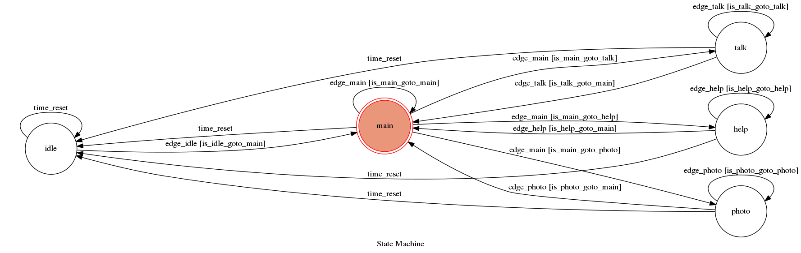

# TOC Project 2017

Final project of NCKU TOC cource

## Require Package
* Python 3
	*   Flask==0.12.1
	*   transitions==0.5.0
	*   pygraphviz==1.3.1
	*   python-telegram-bot==5.3.0
	
	**ADVANCE FEATURE NEED**
	
	*   requests
	*   beautifulsoup4
	*   Selenium

```sh
$ pip install -r requirements.txt
```

## Run the sever

```sh
$ python3 app.py
```

第一次執行會生成 `.token` 和 `.webhook` 檔案

將bot的token和webhook的位址分別填入檔案後繼續即可


### Using `ngrok` as a proxy

下載 `ngrok` 後執行

```sh
$ ngrok http 5000
```

將https位址貼到`.webhook` 檔案中

### Enable advance feature --- **即時圖片爬蟲**

第一次執行後會生成 `enable.photoupdate` 檔案
第一行填入1
第二行及第三行填入 www.pixiv.net 的帳號和密碼
重新執行
```sh
$ python3 app.py
```
即可

## Finite State Machine Graph


## Feature
* Topic : 跟二次元動漫角色的chatbot
* Voice : 某些回覆句子會夾帶音檔 
	* 可在state `main` 以"voice on", "voice off"開關
* Picture : 會從預設資料夾隨機選取一張圖片回傳
	* 可在開啟爬蟲功能的情況下，在state `photo` 輸入"更新"，開啟從網站即時抓取圖片的功能
	* 爬蟲功能有環境依賴性、等待時間久，預設關閉
* Idle : 當一段時間沒有使用(1分鐘)，下次輸入訊息時會自動到state `idle`，需要呼叫她的名字才能繼續使用。
	* (太久不理女朋友會鬧脾氣???)


## Usage
起始state為 `main`.
在任何state，輸入"Bismarck"可回到state `main`

* main
	* Input: "聊天" or "talk"
		* Go to state `talk`
		* Reply: "いいよ"（好喔）
	* Input: "照片" or "photo"
		* Go to state `photo`
		* Reply: "いいよ"（好喔） 且 從預設資料夾中隨機傳送一張圖片	
	* Input: "為什麼不理我" or "help"
        	* Go to state `help`
		* Reply: 簡易使用教學
* talk
	* Input: 關鍵字"聖誕", "聖誕禮物"
        	* Go to state `talk`
		* Reply("聖誕"): "今年もクリスマスの季節なのね。早いわね。さ、プレゼント渡していいのよ？"（今年也到聖誕節了吶。過的真快啊。那個，給我送禮物也是可以的喲！）
		* Reply("聖誕禮物"): "これを私に？･･･Danke schön!"（這個給我？…非常感謝。）
	* Input: 關鍵字"新年", "新年快樂"
		* Go to state `talk`
		* Reply: "提督、新年も頑張っていきましょう。もちろん私は、いつだって頑張ってるわ。" (提督，新年也請努力吧。我當然是一直在努力的咯。)
	* Input: 關鍵字"累"
        	* Go to state `talk`
		* Reply: "アトミラール、何事もあまり頑張り過ぎちゃだめよ。気分転換も、大事なのよ？" (Admiral，幹什麼事情都不要努力過頭了喲。轉換一下心情也是很重要的。)
	* Input: 關鍵字 髒話 
        	* Go to state `talk`
		* Reply: 髒話
* photo
	* Input: "再一張"
        	* Go to state `photo`
		* Reply: 1張圖片
* idle
	* Input: "Bismarck"
    		* Go to state `main`
		* Reply: もう～！この私を放置するなんて、貴方も相当偉くなったものね！ (把我放置不管，你也變得很了不起了嘛！陪陪你出擊呀演習呀也可以的呦！)
* help
	* Input: 任何
        	* Go to state `help`
		* Reply: 簡易使用教學
	
### 爬蟲功能 Example
1. Enable advance feature 參考 Enable advance feature --- **即時圖片爬蟲**
2. 輸入 "Bismarck"
3. 輸入 "照片"
4. 輸入 "更新"
5. 輸入 "再一張" 此時回傳的圖片為網路上即時抓取的(要等數秒鐘)

## Image and Voice Resource
All image file used is collected from pixiv.net and twitter.com, only used for education
All voice file used is collected from zh.moegirl.org, only used for education 

## The author of template code
[Lee-W](https://github.com/Lee-W)
